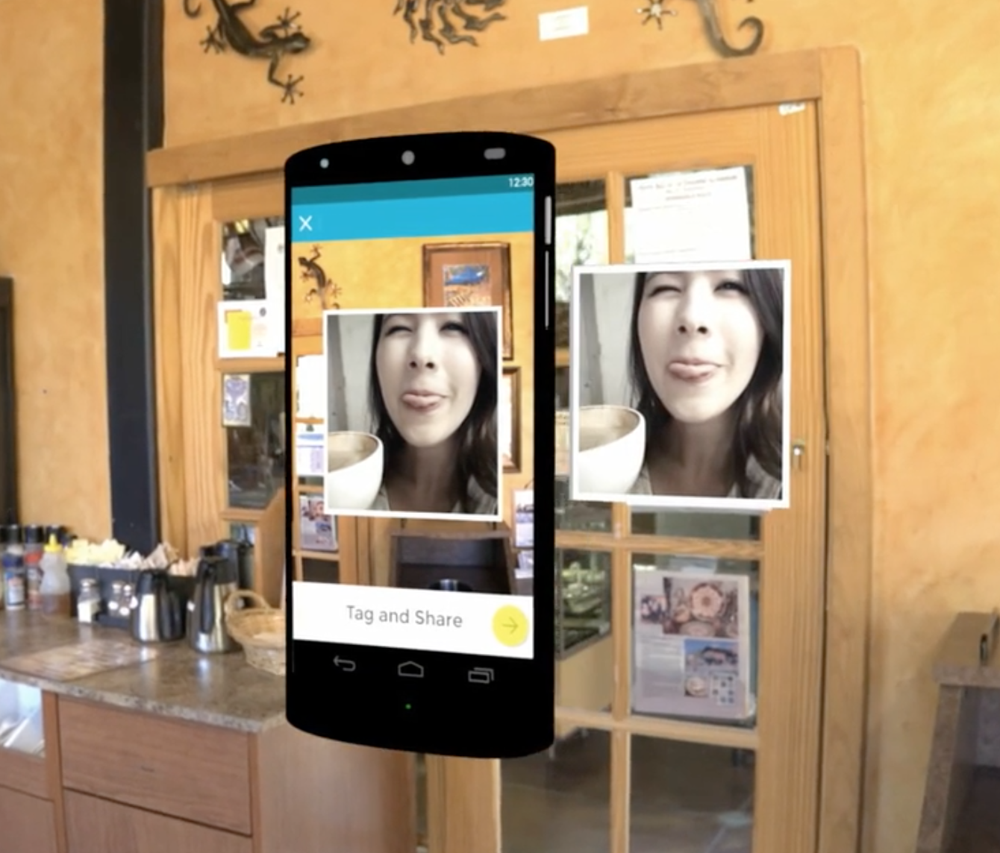
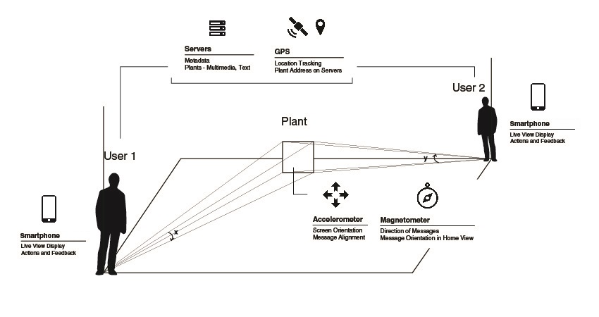
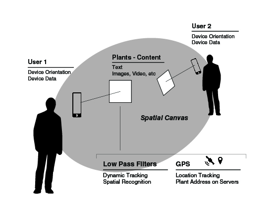
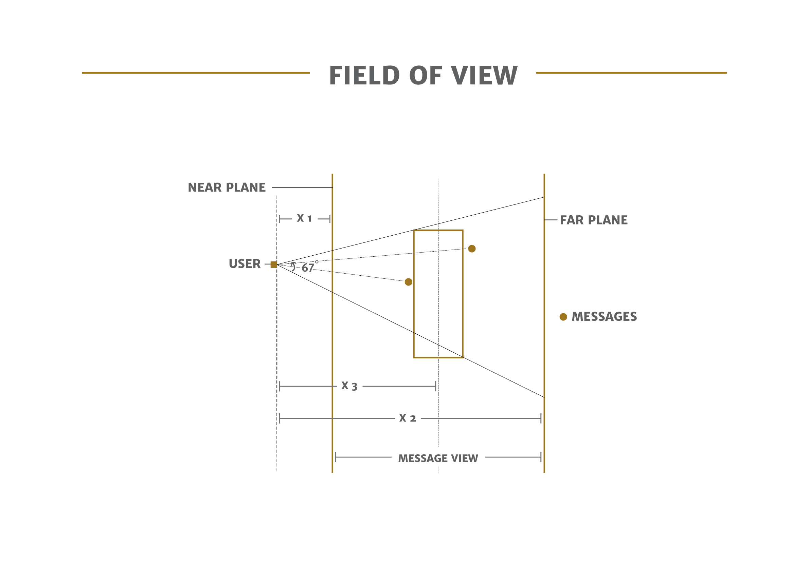
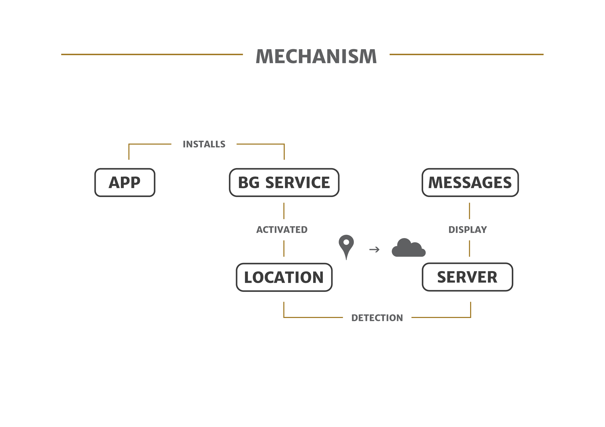
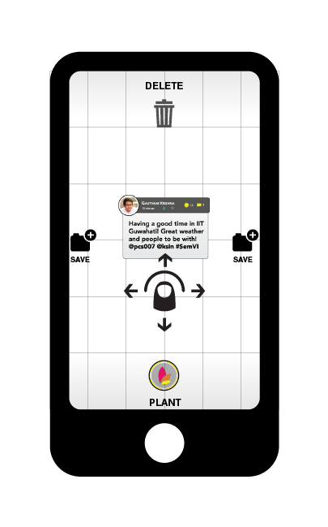

# Enroot AR App 

Enroot is a location based Augmented Reality photo sharing application that surprises you with your friends' memories at different locations. It also throws back memories from the past based on current your visit to any location. Share your memories at any location forever. Happy Discovery!

Users can leave their memories with the Augmented photographs anywhere in the world and anytime. The entire world becomes our Facebook Wall for sharing. You can also get surprised with your friends memories momentarily when you visit those places. You can find what your friends are augmenting and discovering anywhere in the world.

  

  

  

## How It Works
Enroot uses OpenGL to render these augmented images in the cameraview. Images meta data include Lat and Long coordinates, direction relative to the point of posting using sensor data from Accelerometer and Magnetometer, background image processing tracking the canvas pixel information.

  

  

  

  

  

## License

The MIT License (MIT)

Copyright (c) 2015-present Pradeep Periasamy

Permission is hereby granted, free of charge, to any person obtaining a copy of this software and associated documentation files (the "Software"), to deal in the Software without restriction, including without limitation the rights to use, copy, modify, merge, publish, distribute, sublicense, and/or sell copies of the Software, and to permit persons to whom the Software is furnished to do so, subject to the following conditions:

The above copyright notice and this permission notice shall be included in all copies or substantial portions of the Software.

THE SOFTWARE IS PROVIDED "AS IS", WITHOUT WARRANTY OF ANY KIND, EXPRESS OR IMPLIED, INCLUDING BUT NOT LIMITED TO THE WARRANTIES OF MERCHANTABILITY, FITNESS FOR A PARTICULAR PURPOSE AND NONINFRINGEMENT. IN NO EVENT SHALL THE AUTHORS OR COPYRIGHT HOLDERS BE LIABLE FOR ANY CLAIM, DAMAGES OR OTHER LIABILITY, WHETHER IN AN ACTION OF CONTRACT, TORT OR OTHERWISE, ARISING FROM, OUT OF OR IN CONNECTION WITH THE SOFTWARE OR THE USE OR OTHER DEALINGS IN THE SOFTWARE.